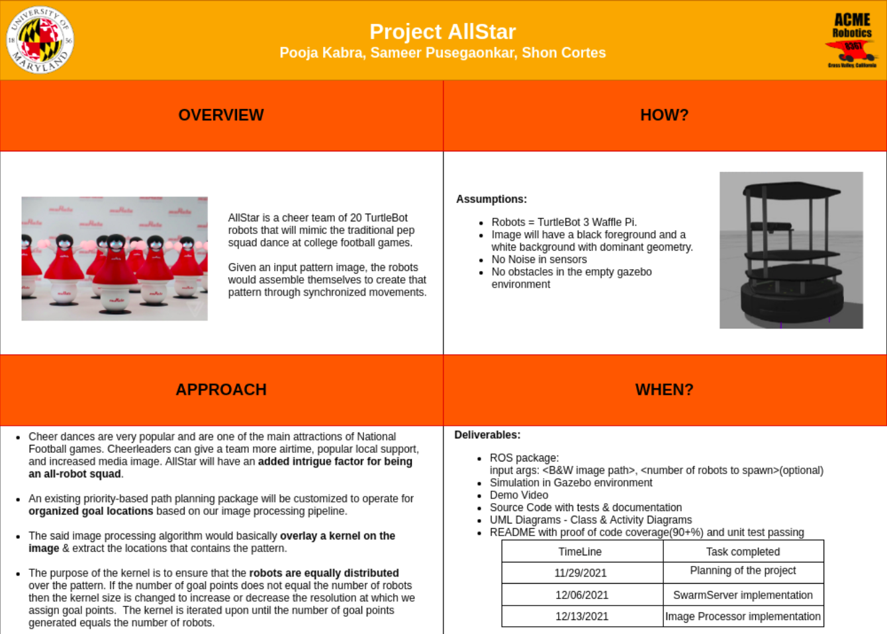

# allstar

---

ROS package for swarm robotics.

Project Codename: AllStar
# Team Members:

- [Shon Cortes](https://github.com/shonbc/)
- [Sameer Pusegaonkar](https://github.com/sampusegaonkar/)
- [Pooja Kabra](https://github.com/pooja-kabra)
 
# Iteration Updates
## Written Proposal:
A 2 Page Written proposal can be found [here](docs/proposal/ENPM808X_Final_Project_Proposal.pdf)

## Product Backlog:
All backlog is being tracked [here.](https://docs.google.com/spreadsheets/d/1sR7KOjVB8bDje8J2QfeGQo_Tc-OPGAuAFRhpCgdOBeA/edit#gid=0)

## Iteration Planning Meetings & Scrum Meeting Notes:
Can be found [here.](https://docs.google.com/document/d/1qceQ_69V6yU-FIa4jNwpUkPDyW1q20VkOy0OK4wDBFg/edit?usp=sharing )
***

# Build the package
Install ROS Melodic [here.](http://wiki.ros.org/melodic/Installation/Ubuntu) 

A catkin workspace is required for this ROS package to run. 

Create a workspace called 'allstar_ws' by following the instructions [here.](http://wiki.ros.org/catkin/Tutorials/create_a_workspace)
    
    #Clone this package into your_workspace/src/
    https://github.com/ShonBC/allstar.git

    chmod +x install_dependencies.sh
    ./install_dependencies.sh

    chmod +x install_ros_packages.sh
    ./install_ros_packages.sh  
    

# Run the package
    roslaunch allstar allstar.launch robot:= 5 # robot:= can be any number of robots from 0 -50.
    rosrun allstar main 5 PATH_TO_IMAGE #PATH_TO_IMAGE should be a abosulte path for the image. 

# Generate cppcheck, cpplint and valgrind results and store in a text file in /results directory:

    chmod +x run_cpplint.sh
    ./run_cpplint.sh

    chmod +x run_cppcheck.sh
    ./run_cppcheck.sh

    chmod +x run_valgrind.sh
    ./run_valgrind.sh

Generate Doxygen files:

    doxygen Doxyfile

# Example Output:
TO-DO

# UML DIAGRAMS:

<em>Figure 1. Activity Diagram</em>

<em>Figure 2. Class Diagram</em>

<em>Figure 3. Quad Chart</em>

***
# Proposal:

## Introduction: 
We love the cheer dances at NFL games. And we love robots. So we decided to put them both together to present to you: AllStar, an all-robot cheerleader squad to lift your spirits and make you smile! AllStar is a cheer team of 20 TurtleBot robots that will mimic the traditional pep squad at college football games. Given an input pattern image, the robots would assemble themselves to create that pattern through synchronized movements and generate enthusiasm in the crowd.

Cheer dances are very popular and are one of the main attractions of National Football games. 25 of the 32 NFL teams include a cheerleading squad in their franchise[1]. Cheerleaders can give a team more airtime, popular local support, and increased media image. AllStar will have an added intrigue factor for being an all-robot squad. Swarm robotics is the future of live entertainment. In the future, the system could be potentially modified to make the software modular and adaptable to a drone robot to create drone displays.

## Assumptions: 
The image which is processed has a black foreground and a white background. All robots have the same hardware. We will be using TurtuleBot 3 Waffle Pi. The image which is processed has some dominant geometry which can include edges, lines, etc. All dimensions and calculations are done in metric. The path planning package provides a mechanism for obstacle avoidance and path planning. It is assumed that all sensors have no noise present in their data. We assume no obstacles except for the robots themselves.

## Project Organization: 
The agile development process will be used for the entire software development stage. This will ensure the quality of work and task tracking. The team consists of 3 people expecting an iteration capacity of 25 work hours during each of the 3 one week sprints. Google sheets & docs will be used to track product backlogs, sprint progress, bug fixes, time logs, and test plans.

An activity diagram has already been prepared and can be found [here](https://drive.google.com/drive/u/0/folders/11hSVRQvm8t9pQ3932fFaw2wM_Ex2pJ1h). Our future work includes building a class diagram that will provide a structure to this project. This fills in our product backlog. The backlog will then be divided into 3 different parts for each iteration. After each iteration any bugs, new features will be added to the backlog and will be taken into consideration for future iterations. Daily scrum meetings will take place to discuss any issues and progress the pair faces. At the end of each iteration, the design keeper will review the merge request and merge if the implementation follows the UML. 

Unit tests and Integration will be written using the rostest to ensure full code coverage and proper operation. 

We plan to incorporate the entire project for a single robot first. After we successfully test individual modules, we keep incrementing the number of robots we work with.

## Managerial Process: 
Testing will be done on the entire codebase. In particular, time-based tests will be written to make sure the robots reach their destination in a small amount of time. This is essential to provide a fast formation of the geometry pattern. 
Additional tests will be written to make sure the sensors - lidar and motor encoders are working correctly and if the robots reach their goal location or not.
 
 
## Technical Process:
The input to the system would be an image of a black pattern on a white background. Using appropriate image processing algorithms, the system would process the image to extract goal locations for N >= 20 robots.
The said image processing algorithm would basically overlay a kernel on the image, extract the location that contains the pattern, and transform those coordinates from the image frame to the world frame. These coordinates would then be assigned to the robots.

The purpose of the kernel is to ensure that the robots are equally distributed over the pattern. If the number of goal points does not equal the number of robots then the kernel size is changed to increase or decrease the resolution at which we assign goal points.  The kernel is iterated upon until the number of goal points generated equals the number of robots.

These goal locations would then be issued to the multi-robot framework and it would plan trajectories for each of the robots and send them on their way. The multi-robot framework here is a repository[2] that includes ROS packages to plan routes for multiple robots on a search graph. It creates a search graph out of a pixel map and tries to find a path for multiple robots using an extended approach for prioritized planning. The inputs are the tuw_multi_robot_msgs/RobotInfo[2] messages which include the robot’s pose, the map, and the desired goal poses. The outputs are multiple synchronized routes given to the individual robots.

## Potential Risks And Mitigation:
Because we only have a limited number of robots, it is possible for more goal points to be generated than there are robots that have been spawned. We plan to resize the kernel dynamically to ensure the number of goal points always equals the number of robots. As the kernel is iterated upon, it is possible for the algorithm to get stuck in an infinite loop if the geometry cannot be broken down into an equal number of goal points as there are robots. If this occurs we remove any excess goal points before assigning goal locations to the robots.

Another challenge is expected in integrating a large number of existing packages with our application. The packages however seem to be sufficiently documented and should be a good amount of help. As a backup plan, we plan to implement our own path planning algorithm.

## Deliverables:
The final deliverable would be a ROS package that would take in a B&W image path and an optional argument for the number of robots to spawn. These robots would recreate the image pattern in the empty Gazebo environment. We will also include a video to demonstrate how to use the package. The entire codebase will be well-documented & fully tested. 

## Work Packages with licenses:
C++ 11 and above will be the primary language for the entire codebase. We will be utilizing Cmake version 3.2.1 for our build system. For processing our video input, OpenCV version 4.0.0 (Apache 2 license) will be used. Eigen 3 will also be used for linear algebra which uses the MPL2 license. We will also be utilizing ROS Melodic & Gazebo on Ubuntu 18.04 for our multi-robot system which uses the BSD License. This includes tf, odom, roscpp, rospy, nav_msgs, geometry_msgs, std_msgs, nodelet, rostest will use gtest, google mock and turtlebot package. We also plan to use the Tuw_multi_robot package for routing the robots. This package is licensed as BSD. 
References:

[1] [NFL Cheerleading](https://en.wikipedia.org/wiki/National_Football_League_Cheerleading#cite_note-2)

[2] [Tuw_multi_robot packages](https://github.com/tuw-robotics/tuw_multi_robot)

[3] [Tuw_multi_robot](http://wiki.ros.org/tuw_multi_robot)

[4] [Multi Robot Route Planning (MRRP)](https://ieeexplore.ieee.org/document/8968465)
***

# Know Issues/Bugs:
